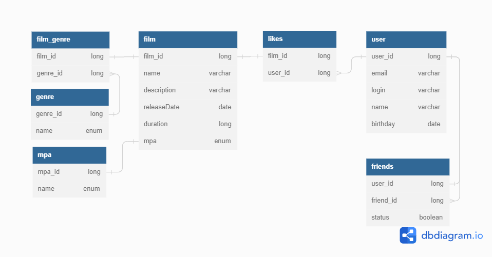

# java-filmorate

# sqlRev

<picture>
    <source media="(prefers-color-scheme: dark)" srcset="src/main/resources/readme/sqlRevPngDark.png">
    <source media="(prefers-color-scheme: light)" srcset="src/main/resources/readme/sqlRevPng.png">
    
</picture>  

#Код [https://dbdiagram.io/](https://dbdiagram.io/)  
Table Film {
film_id long
name String
description String
releaseDate date
duration long
age_rating Enum
}

Table Likes {
film_id long
user_id long
}

Table User {
user_id long
email String
login String
name String
birthday date
}

Table Age_rating {
name enum
}

Table Film_Genre {
film_id long
genre_id long
}

Table Genre {
genre_id long
name enum
}
Table Friends {
user_id long
friend_id long
status boolean
}

Ref: "Film"."age_rating" - "Age_rating"."name"

Ref: "Film"."film_id" - "Likes"."film_id"

Ref: "Likes"."user_id" > "User"."user_id"

Ref: "Film"."film_id" - "Film_Genre"."film_id"

Ref: "Genre"."genre_id" < "Film_Genre"."genre_id"

Ref: "User"."user_id" - "Friends"."user_id"

Ref: "Friends"."friend_id" > "User"."user_id"

